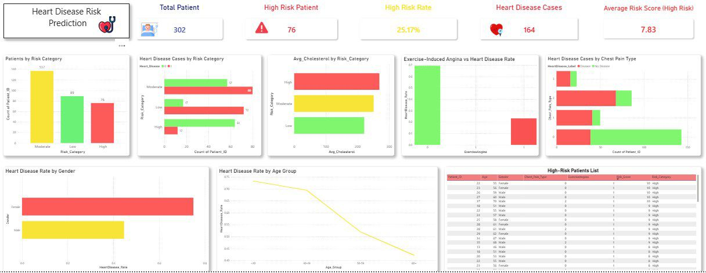

# Heart Disease Risk Prediction Decision Support System

## Overview

This project develops a data-driven Decision Support System (DSS) to identify patients at risk of heart disease using healthcare data analytics.

The project includes data preprocessing, risk classification, dashboard development, and visualization of patient health indicators to support decision-making.

## Tools Used

- Power BI
- Python
- Microsoft Excel

## Features

- Heart Disease Risk Classification
- KPI Monitoring Dashboard
- Patient Segmentation
- Cholesterol Analysis
- Age Group Analysis
- Risk Category Analysis

## Dashboard Preview

## Skills Demonstrated

- Data Analytics
- Data Visualization
- Dashboard Development
- Healthcare Analytics
- Decision Support Systems
- Data Preprocessing
- Business Intelligence
